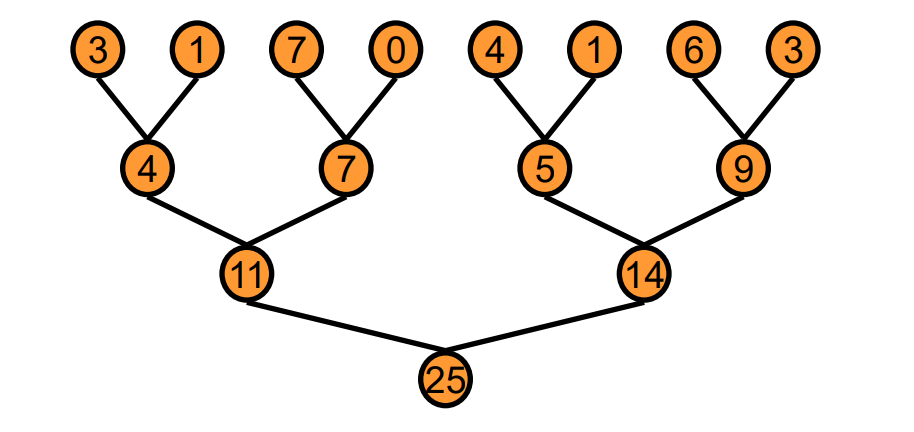
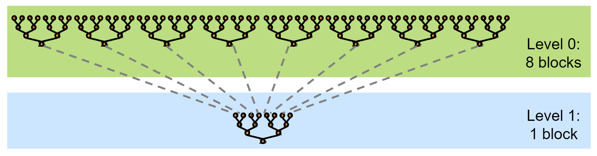

# reduce算子优化
对输入的多维张量（Tensor）数据，在某一维上执行特定的计算（比如sum、求max/min等），从而达到降低维度的目的。<br><br>


## reduce计算方式
树形计算方式：在每个线程块中基于树的实现方法<br><br>


## reduce计算方式的两个步骤（以sum为例）
步骤一：将数据分割到8个block中，然后两两元素进行sum，不断递归整个过程直到每个block中所有元素sum完毕。<br>
步骤二：对所有block中的8个数据重复步骤一。<br><br>


为什么要设计成两步（第一步8个block，第二步一个block）？  
如果能同步所有block，reduce能处理非常大的数组（每个block产生结果后进行全局同步，一旦所有block达到同步，递归继续），但CUDA是没有全局同步的，所以通过将其分解成多个核函数进行同步，核函数启动作为全局同步点，这样硬件开销几乎可以忽略不记且软件开销低。

两步的核函数是相同的，只优化一个即可。
我们应该努力达到GPU峰值性能。  
参数  
1.compute-bound kernels：GFLOP/s  
2.memory-bound kernels：Bandwidth  
reduce计算强度低，所以主要优化的是峰值带宽的性能。

base的实现

``` CUDA
__global__ void reduce0(float* g_idata, float* g_odata) {

	extern __shared__ float sdata[THREAD_PER_BLOCK];

	// 每一个线程从全局内存装载一个元素到共享内存
	unsigned int tid = threadIdx.x;
	unsigned int i = blockIdx.x * blockDim.x + threadIdx.x;
	sdata[tid] = g_idata[i];
	__syncthreads();

	// 在共享内存上执行reduce计算
	for (unsigned int s = 1; s < blockDim.x; s *= 2) {
		if (tid % (2 * s) == 0) {
			sdata[tid] += sdata[tid + s];
		}
		__syncthreads();
	}

	// 将该块的结果写到全局内存
	if (tid == 0) g_odata[blockIdx.x] = sdata[0];

}
```

问题：Warp Divergence <br>
优化一：交错寻址 <br>
用跨步索引和非发散分支替换发散分支

``` CUDA
__global__ void reduce1(float* g_idata, float* g_odata) {

	extern __shared__ float sdata[THREAD_PER_BLOCK];

	// 每一个线程从全局内存装载一个元素到共享内存
	unsigned int tid = threadIdx.x;
	unsigned int i = blockIdx.x * blockDim.x + threadIdx.x;
	sdata[tid] = g_idata[i];
	__syncthreads();

	// 在共享内存上执行reduce计算
	for (unsigned int s = 1; s < blockDim.x; s *= 2) {
        int index = 2 * s * tid;
		if (index < blockDim.x) {
			sdata[index] += sdata[index + s];
		}
		__syncthreads();
	}

	// 将该块的结果写到全局内存
	if (tid == 0) g_odata[blockIdx.x] = sdata[0];

}
```

问题：共享内存中bank冲突<br>
优化二：顺序寻址<br>
使用逆向循环和基于threadID的索引替换内部循环中的跨步索引

``` CUDA
__global__ void reduce2(float* g_idata, float* g_odata) {

	extern __shared__ float sdata[THREAD_PER_BLOCK];

	// 每一个线程从全局内存装载一个元素到共享内存
	unsigned int tid = threadIdx.x;
	unsigned int i = blockIdx.x * blockDim.x + threadIdx.x;
	sdata[tid] = g_idata[i];
	__syncthreads();

	// 在共享内存上执行reduce计算
	for (unsigned int s = blockDim.x/2; s > 0; s >>= 2) {
		if (tid < s) {
			sdata[tid] += sdata[tid + s];
		}
		__syncthreads();
	}

	// 将该块的结果写到全局内存
	if (tid == 0) g_odata[blockIdx.x] = sdata[0];

}

```
问题：闲置线程<br>
优化三：加载时第一次添加
将块数减半，用两个加载和首次添加替换单个加载。

``` CUDA
__global__ void reduce3(float* g_idata, float* g_odata) {

	extern __shared__ float sdata[];

	// 每一个线程从全局内存装载一个元素到共享内存
	unsigned int tid = threadIdx.x;
	unsigned int i = blockIdx.x * (blockDim.x*2) + threadIdx.x;
	sdata[tid] = g_idata[i]+g_idata[i+blockDim.x];
	__syncthreads();

	// 在共享内存上执行reduce计算
	for (unsigned int s = blockDim.x/2; s > 0; s >>= 1) {
		if (tid < s) {
			sdata[tid] += sdata[tid + s];
		}
		__syncthreads();
	}

	// 将该块的结果写到全局内存
	if (tid == 0) g_odata[blockIdx.x] = sdata[0];

}
```

问题：指令瓶颈 <br>
优化四：展开最后一轮Warp <br>
由于一个warp中的32个线程在同一个SIMD单元上，这32个线程每次都是执行同一指令，不需要进行同步，我们可以将最后一维展开以减少同步。

``` CUDA

__device__ void warpReduce(volatile int* sdata, int tid) {
	sdata[tid] += sdata[tid+32];
	sdata[tid] += sdata[tid+16];
	sdata[tid] += sdata[tid+8];
	sdata[tid] += sdata[tid+4];
	sdata[tid] += sdata[tid+2];
	sdata[tid] += sdata[tid+1];
}

__global__ void reduce4(float* g_idata, float* g_odata) {

	extern __shared__ float sdata[];

	// 每一个线程从全局内存装载一个元素到共享内存
	unsigned int tid = threadIdx.x;
	unsigned int i = blockIdx.x * (blockDim.x*2) + threadIdx.x;
	sdata[tid] = g_idata[i]+g_idata[i+blockDim.x];
	__syncthreads();

	// 在共享内存上执行reduce计算
	for (unsigned int s = blockDim.x/2; s > 32; s >>= 1) {
		if (tid < s) {
			sdata[tid] += sdata[tid + s];
		}
		__syncthreads();
	}
	if (tid < 32) warpReduce(sdata, tid);

	// 将该块的结果写到全局内存
	if (tid == 0) g_odata[blockIdx.x] = sdata[0];

}

```

问题：for循环开销 <br>
优化五：完全展开 <br>
直接将for循环展开

``` CUDA

Template <unsigned int blockSize>
__device__ void warpReduce(volatile int* sdata, int tid) {
	if (blockSize >= 64) sdata[tid] += sdata[tid+32];
	if (blockSize >= 32) sdata[tid] += sdata[tid+16];
	if (blockSize >= 16) sdata[tid] += sdata[tid+8];
	if (blockSize >= 8) sdata[tid] += sdata[tid+4];
	if (blockSize >= 4) sdata[tid] += sdata[tid+2];
	if (blockSize >= 2) sdata[tid] += sdata[tid+1];
}

Template <unsigned int blockSize>
__global__ void reduce5(float* g_idata, float* g_odata) {

	extern __shared__ float sdata[];

	// 每一个线程从全局内存装载一个元素到共享内存
	unsigned int tid = threadIdx.x;
	unsigned int i = blockIdx.x * (blockDim.x*2) + threadIdx.x;
	sdata[tid] = g_idata[i]+g_idata[i+blockDim.x];
	__syncthreads();

	// 在共享内存上执行reduce计算
	if (blockSize >= 512) {
		if (tid < 256) {
			sdata[tid] += sdata[tid + 256];
		}
		__syncthreads();
	}
	if (blockSize >= 256) {
		if (tid < 128) {
			sdata[tid] += sdata[tid + 128];
		}
		__syncthreads();
	}
	if (blockSize >= 128) {
		if (tid < 64) {
			sdata[tid] += sdata[tid + 64];
		}
		__syncthreads();
	}
	if (tid < 32) warpReduce<blockSize>(sdata, tid);

	// 将该块的结果写到全局内存
	if (tid == 0) g_odata[blockIdx.x] = sdata[0];

}

```

问题：blocksize和gridsize的取值 <br>
优化六：合理设置block数量
block数量越多，block可以快速地切换，去掩盖访存的延时。但thread被分配的工作越多，编译器可能会进行指令重排，也会覆盖访存时的巨大延时，所以block的设置也并不是越多越好，可能需要比较合理的设置。


```

Template <unsigned int blockSize>
__device__ void warpReduce(volatile int* sdata, int tid) {
	if (blockSize >= 64) sdata[tid] += sdata[tid+32];
	if (blockSize >= 32) sdata[tid] += sdata[tid+16];
	if (blockSize >= 16) sdata[tid] += sdata[tid+8];
	if (blockSize >= 8) sdata[tid] += sdata[tid+4];
	if (blockSize >= 4) sdata[tid] += sdata[tid+2];
	if (blockSize >= 2) sdata[tid] += sdata[tid+1];
}

Template <unsigned int blockSize>
__global__ void reduce5(float* g_idata, float* g_odata) {

	extern __shared__ float sdata[];

	// 每一个线程从全局内存装载一个元素到共享内存
	unsigned int tid = threadIdx.x;
	unsigned int i = blockIdx.x * (blockSize*2) + threadIdx.x;
	unsigned int gridSize = blockSize * 2 * gridDim.x;
	sdata[tid] = 0;

	while (i < n) {
		sdata[tid] = g_idata[i]+g_idata[i+blockSize];
		i += gridSize;
	}
	__syncthreads();

	// 在共享内存上执行reduce计算
	if (blockSize >= 512) {
		if (tid < 256) {
			sdata[tid] += sdata[tid + 256];
		}
		__syncthreads();
	}
	if (blockSize >= 256) {
		if (tid < 128) {
			sdata[tid] += sdata[tid + 128];
		}
		__syncthreads();
	}
	if (blockSize >= 128) {
		if (tid < 64) {
			sdata[tid] += sdata[tid + 64];
		}
		__syncthreads();
	}
	if (tid < 32) warpReduce<blockSize>(sdata, tid);

	// 将该块的结果写到全局内存
	if (tid == 0) g_odata[blockIdx.x] = sdata[0];

}

```


优化七：使用shuffle指令 <br>
Shuffle指令是一组
Shuffle指令是一组针对warp的指令。Shuffle指令最重要的特性就是warp内的寄存器可以相互访问。在没有shuffle指令的时候，各个线程在进行通信时只能通过shared memory来访问彼此的寄存器。而采用了shuffle指令之后，warp内的线程可以直接对其他线程的寄存器进行访存。通过这种方式可以减少访存的延时。除此之外，带来的最大好处就是可编程性提高了，在某些场景下，就不用shared memory了。毕竟，开发者要自己去控制 shared memory还是挺麻烦的一个事。


|          |  时间 | 带宽(GB/s) | 加速比 |
| :-----:  |  :-------:  |  :-------: |  :--: |
| reduce0  |    1.49ms   | 49.46 | |
| reduce1  |    1.25ms    | 59.01 | |
| reduce2  |    0.99693ms    | 73.98 | |
| reduce3  |    49600    | | |